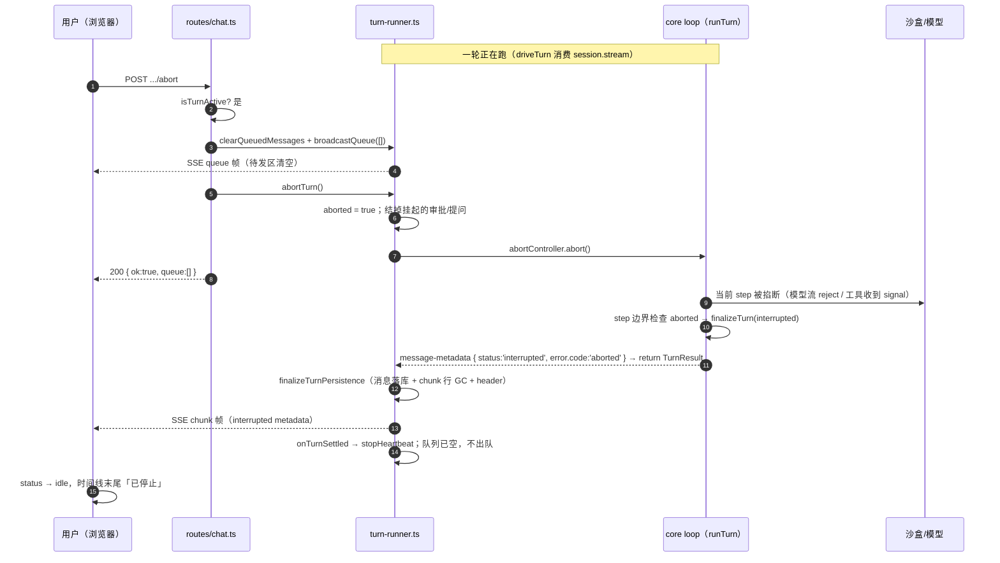
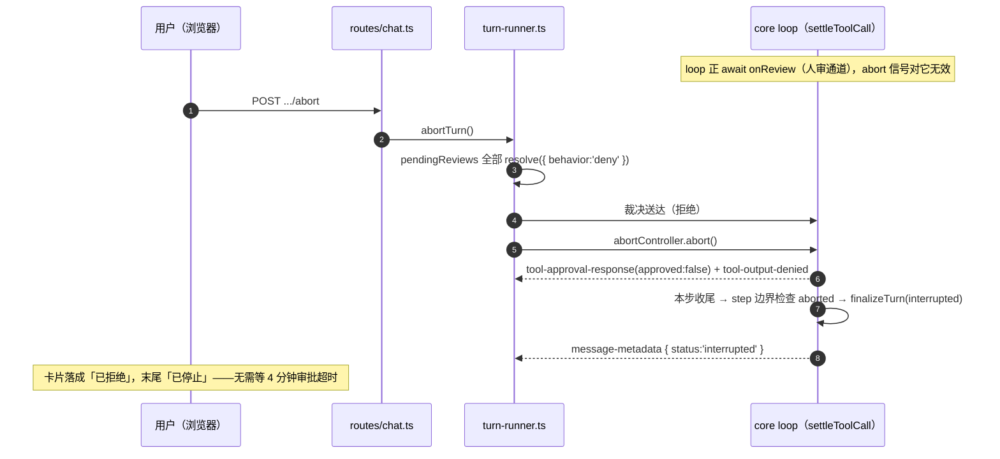
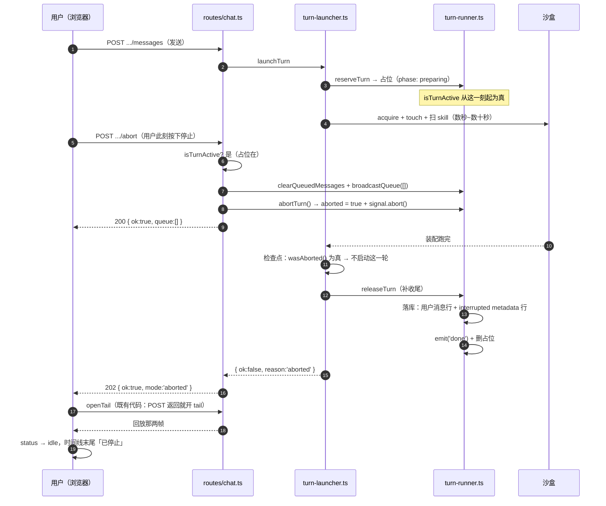

# 停止本轮（技术方案）

> 相关：产品/使用视角见 [../features/turn-abort.md](../features/turn-abort.md)，施工进展见 [../plans/turn-abort.md](../plans/turn-abort.md)。
> 依赖/延续：[chat webapp 技术方案](./chat-webapp.md) §2.2b（轮的进程内驱动与直播流）· [中途插话与排队](./steer-and-queue.md) §3（`turn-launcher` / `onTurnSettled` 这条自动[出队](../terms.md)链条）· [UIMessage 单账本](./single-ledger.md) §5 单-3（落盘时序、[transient/persistent](../terms.md) 两档）· [核心 SDK](./core-sdk.md) §4.2（`TurnOptions.signal`）。
> 术语一律以 [../terms.md](../terms.md) 为准（**停止**、[轮](../terms.md)、[step](../terms.md)、[账本](../terms.md)、[待发队列](../terms.md)、[审批卡片](../terms.md)）。

## 1. 方案总览

一句话：**复用 `@nimbo/core` 已有的 `TurnOptions.signal`**，chat 服务端为每一轮持有一个 `AbortController`，`POST .../abort` 触发它；core 的 loop 在 step 边界看到 abort 就走**优雅收尾**（`status: 'interrupted'` + `NimboError.code: 'aborted'`），于是账本、GC、直播流全部按既有路径跑完。

三个关键结论（也是本方案能这么小的原因）：

1. **不需要新的账本条目类型、不需要 DB 迁移。** 被停止的一轮走的是 core 既有的「优雅中途降级」路径（`loop.ts` 的 `finalizeTurn` 产出一条带 `status: 'interrupted'` 的 `message-metadata` chunk 后正常 `return TurnResult`），因此 `turn-runner.ts` 的 `finalizeTurnPersistence` 照常执行：这一轮的消息落 `kind = 'message'` 行、`kind = 'chunk'` 行 GC、会话 header 更新。刷新页面的回放与正常收尾的一轮**走同一段代码**。
2. **「停止」的可见性不需要新的 wire 帧。** 界面靠那条 `message-metadata`（`status: 'interrupted'`、`error.code: 'aborted'`）认出「已停止」，与它认「已失败」是同一个机制。
3. **`@nimbo/core` 只需要一处小改**：在 `runTurn` 的 step 循环开头显式检查 `abortSignal.aborted`。不加这一处也能停（AI SDK 的 `streamText` 遇到已 abort 的 signal 会 reject，落进 loop 既有的 catch → `code: 'aborted'`），但那要多打**一次**模型调用才停得下来，而且把停止时机的确定性外包给了第三方库的行为细节。见 §6.1。

### 1.1 改动落点

| 层 | 文件 | 改什么 |
|---|---|---|
| core | `packages/core/src/loop.ts` | `runTurn` step 循环开头检查 `abortSignal.aborted` → `finalizeTurn(status: 'interrupted')` + return |
| server | `agent/turn-runner.ts` | 每轮一个 `AbortController`；`stream(text, { signal })`；新增 `abortTurn()`；挂起的[人审通道](../terms.md)/ask-user 在停止时就地结掉 |
| server | `routes/chat.ts` | 新增 `POST /api/chat/conversations/{id}/abort` |
| server | `schemas/chat.ts` | 新增 `AbortTurnAckSchema` |
| web | `features/chat/api.ts` + `schema.ts` | `postAbortTurn()` + 响应解析 |
| web | `features/chat/use-chat-messages.ts` | `cancel`（假停止）→ `stopTurn`（真停止）+ `stopping` 态；`interrupted` 不再算 error |
| web | `components/message-composer.tsx` | 流式态的发送键变停止键 |
| web | `components/turn-marker.tsx` | `code: 'aborted'` 渲染成中性的「已停止」，不是 destructive |

**没有 DB 改动**：停止时清空[待发队列](../terms.md)用的是既有的 `conversations.queued_messages_json` 与既有的 `clearQueuedMessages()`，业务数据领域没有新实体、没有新关系。

> **2026-07-27 补丁**：上面这套只覆盖了「一轮**已经跑起来**之后按停止」。「刚点发送就点停止」当时停不下来（按钮毫无反应），因为那一刻服务端还不认这一轮存在。修法与改动落点见 [§3.3](#33-起轮装配窗口里的停止2026-07-27-修)。

## 2. core：step 边界的显式 abort 检查

`packages/core/src/loop.ts` 的 `runTurn`，for 循环开头（在 drain steer 队列与上下文估算**之前**）：

```ts
if (abortSignal.aborted) {
  const error: NimboError = { code: "aborted", message: "Turn aborted before this step began (host abort signal)." };
  yield finalizeTurn({ ..., status: statusForError(error), error });
  return { finalResponse, usage };
}
```

- `statusForError` 已经把 `code === 'aborted'` 映射成 `'interrupted'`（既有代码，`loop.ts`），所以状态语义无需新增。
- 检查点选在**循环开头**而不是每个 chunk 之后：一步之内的中止交给 AI SDK 的 `abortSignal`（模型流会被掐断、`streamText` 的 promise reject → 落进既有 catch → 同样是 `code: 'aborted'`），这里只保证「**绝不开始新的一步**」。两条路径产出的收尾形状一致。
- 工具执行中的中止同理：`ToolContext.abortSignal` 已经透传给工具（`runtime.ts`），bash 的 `exec()` 会以「失败即 ExecResult」的方式收尾（`docs/features/builtin-tools.md`），那一步正常结束，随后被本检查拦在下一步之前。

## 3. server：每轮一个 AbortController

### 3.1 `turn-runner.ts`

```ts
interface ActiveTurn {
  // …既有字段
  /** 这一轮的中止闸门——`startTurn` 建，`abortTurn` 触发，`session.stream(text, { signal })` 消费。 */
  abortController: AbortController;
  /** 已请求停止。幂等用，也是 `requestReview`/`requestUserAnswer` 的「别再挂新的」闸门。 */
  aborted: boolean;
}

export function abortTurn(conversationId: string): boolean;
```

`abortTurn` 的顺序是**硬要求**（每一步都有理由）：

1. 没有进行中的一轮 → 返回 `false`（路由转 409）。
2. `activeTurn.aborted === true` → 直接返回 `true`（幂等，连点无副作用）。
3. 置 `aborted = true`。**先置位再做后面的事**：它同时是 `requestReview`/`requestUserAnswer` 的闸门——停止后 core 若还为同一步里的其它并行工具调用请求审批（`loop.ts` 的 `mergeSettleStreams` 让一步内的多个工具调用并发结算），那些请求要立即被拒/超时，而不是挂到自己的 4 分钟超时。
4. 结掉**已经挂起**的审批与提问：`pendingReviews` 全部按 `deny`（理由文案说明是被停止）、`pendingQuestions` 全部按 `{ outcome: 'timeout' }`。不做这一步的话，一轮停在审批卡片上时 core 正 `await onReview`，abort 信号对它毫无作用——要等 `CHAT_APPROVAL_TIMEOUT_MS`（默认 240 秒）才动。**这是本功能唯一一处「abort 信号本身不够」的地方。**
5. `abortController.abort(new Error('Turn stopped by the user.'))`。

`TurnDrivenSession.stream` 的签名随之放宽为 `stream(input: string, opts?: { signal?: AbortSignal }): AsyncGenerator<NimboChunk, TurnResult>`——`@nimbo/core` 的 `Session.stream` 本就是这个形状（`TurnOptions`），测试用的 fake 忽略第二个参数也仍然满足接口（向后兼容，既有 fake 不改也能编译）。

### 3.2 `routes/chat.ts`：`POST .../abort`

```
POST /api/chat/conversations/{id}/abort
200 → { ok: true, queue: [] }     // AbortTurnAckSchema
404 → 会话不存在 / 不属于调用者
409 → 没有进行中的一轮（含「刚好自己结束了」的窄竞态）
```

handler 的顺序同样是硬要求：

1. `getConversation` → 404。
2. `isTurnActive(id)` 为假 → 409（**不做任何副作用**：没有轮在跑时清队列会让「误点停止」变成「丢消息」）。
3. `clearQueuedMessages(db, id)` + `broadcastQueue(id, [])`。
4. `abortTurn(id)`；`false` → 409。

**为什么清队列必须在 abort 之前**：`turn-runner.ts` 的 `onTurnSettled` 会在这一轮彻底结束后自动[出队](../terms.md)起下一轮（[steer-and-queue §3](./steer-and-queue.md)）。反过来（先 abort 再清）存在真实竞态——abort 解开挂起的审批后这一轮可能很快收尾，队首那条就被自动发出去了，而用户刚刚按的是「停止」。先清后 abort 则从结构上不可能：出队时队列已空。

**为什么广播要在这一轮还活着的时候发**：`broadcastQueue` 只对进行中那一轮的订阅者有效（emitter 关了就是无操作）。轮结束后前端也不会重连（`turnInProgressRef` 已翻假），所以这一帧必须趁 emitter 还开着发出去，否则界面待发区要等到下次刷新才清空。

**沙盒不额外 `touch`**：停止之后不再有活动，让它按既有的空闲超时自然休眠；心跳由既有的 `onTurnSettled → stopHeartbeat()` 停掉，无需改动。

### 3.3 起轮装配窗口里的停止（2026-07-27 修）

#### 问题：两边对「这一轮从何时开始存在」定义不一致

用户报的现象是「发完消息立刻点停止，没有任何反应」。追下来是一段**空窗**：

- **前端**认为这一轮从「用户点发送」起就存在：`sendMessage` 同步把 `turnInProgressRef` 置真、`status` 拍成 `streaming`，停止键当场可点，不等服务端回话。
- **服务端**认为这一轮从「[起轮装配](../terms.md)跑完」起才存在：`launchTurn` 要先取沙盒 → `touch` 续期 → 扫沙盒里的 skill → `buildSession`，全部做完，**最后一步** `startTurn` 才把它记进 `activeTurns`。

于是空窗期内 `isTurnActive()` 为假 → `POST .../abort` 回 409 → 前端按 [§4.1](#41-hookuse-chat-messagests) 的既有约定把 409 当成「这一轮已经自己结束了，用户要的结果已达成」**静默吞掉**。界面一个字都不变，而那一轮几秒后照样跑起来。

空窗的宽度 = 一次沙盒 acquire + 一次 touch + 一次 skill 扫描 + 一次 `buildSession`，全是远程往返，冷启动可达数秒到数十秒——所以「刚发出就点停止」几乎**必然**落在窗口里，这不是窄竞态。

#### 修法：把登记时机提前到装配的第一行（[起轮占位](../terms.md)）

```ts
type TurnPhase = 'preparing' | 'running';

interface TurnReservation {
  readonly conversationId: string;
  /** 这一轮唯一的那个 signal：装配期间就已就绪，装配跑完原样交给 core。 */
  readonly signal: AbortSignal;
  /** 装配期间是否已被请求停止——`launchTurn` 在检查点读它。 */
  readonly wasAborted: () => boolean;
}

/** 占位登记一轮，`isTurnActive` 立刻为真。已有轮（**装配中的也算**）→ `undefined`。 */
export function reserveTurn(conversationId: string, logger?: Logger): TurnReservation | undefined;
/** 撤销占位。被停止过则先补一次「已停止」收尾（见下），随后 `emit('done')` + 删登记。 */
export function releaseTurn(db: Db, reservation: TurnReservation, text: string, logger?: Logger): void;
/** 这个会话有没有一轮**卡在装配中**——路由给 steer 分流用（见下）。 */
export function isTurnPreparing(conversationId: string): boolean;
```

三条纪律：

1. **占位与真正跑起来的那一轮是同一个 `ActiveTurn` 对象。** `startTurn` 收到 `reservation` 时**原地升级** `phase: 'preparing' → 'running'`（补上 `steer`/`emit`），不是「删占位再登记」——那中间又是一个新空窗，等于把 bug 挪个位置。
2. **`releaseTurn` 必须兜住装配的每一条退出路径**（凭据缺失、沙盒起不来、`buildSession` 抛错、期间被停止），所以 `launchTurn` 用 `try/finally` + 一个 `handedOff` 标志来保证，而不是在每个 `return` 前手写一遍。漏掉任何一条 = 把这个会话**永久锁死**：`isTurnActive` 恒真，此后所有消息只会排队、再也起不了轮。这是本次改动风险最高的一点。
3. **`releaseTurn` 一定要 `emitter.emit('done')`。** 占位让 `isTurnActive` 为真，于是装配中的轮**已经能被 tail 订阅**（`GET .../stream` 的 `wasActive` 为真 → 它会挂着等 `done`）。不发就把那条 tail 挂到超时。

#### 装配窗口里被停的那一轮，怎么收尾

产品定案是「落[账本](../terms.md)+ 打『已停止』标记」（[features §2.5](../features/turn-abort.md)），所以 `releaseTurn` 在 `wasAborted()` 为真时补两帧——两者都用既有机制，**不新增任何 wire 形状**：

1. 一条合成的用户消息 `MessageFrame`，与 `driveTurn` 开头那条同源同形（同一个 `createTurnEmitter`），落 `kind = 'message'` 行；
2. 一条**独立**的 `message-metadata` chunk，`status: 'interrupted'` + `error.code: 'aborted'`，落 `kind = 'chunk'` 行——与 `driveTurn` 的 `catch` 分支发独立 metadata chunk 是同一姿态。`turn` 字段填 `undefined`：装配可能在 `buildSession` 之前就退出，此刻根本没有 session 可问轮号（`bestEffortTurn` 问不出来时也是 `undefined`，一致）。

这条路上 `finalizeTurnPersistence` 不跑（没有 session、没有 `TurnResult`），所以那条 `kind = 'chunk'` 行不会被 GC——与 `catch` 分支同款的既有可接受残留（`schema.ts` 的注释），一轮只多一行。

#### 前端要改的只有一处

那两帧是**持久帧**，所以前端在 `POST .../messages` 返回后照旧 `openTail()`，tail 一连上就把它们当普通回放帧收下：`MessageLedger` 认出独立的 turn-end metadata → `interrupted` 归 idle（[§4.1](#41-hookuse-chat-messagests) 的既有映射）→ 时间线末尾中性「已停止」标记（[§4.3](#43-已停止的样子turn-markertsx)）。**全是既有代码，一行不改。**

契约上多一档：`POST .../messages` 的 ack `mode` 加 `'aborted'`（诚实报告「这一轮在装配阶段就被停掉了，从没启动」）。要改的那一处前端是 **steer 的乐观回显**——见下。

#### 顺带修掉的第二个 bug + steer 的分流

占位让 `isTurnActive` 在空窗里就为真，于是空窗内发的第二条消息走[排队](../terms.md)，不再像以前那样触发**第二次完整装配**、最后被 `startTurn` 的 busy 守卫挡掉（白烧一次沙盒往返）。

但 steer 这条路要重新分流：`steerTurn` 对 `phase === 'preparing'` 只能返回 `false`（那一轮还没有 `session`，插不进去），而路由原来的「steer 失败就回落起新一轮」会被自己的占位挡成 409。所以按**原因**分流：

| steer 返回 false 的原因 | 怎么办 |
|---|---|
| `isTurnPreparing(id)` 为真——那一轮还在装配 | **入队**。它收尾时会自动[出队](../terms.md)，用户的话不会丢 |
| 否则——这一轮刚好结束的窄竞态 | 回落起新一轮（既有行为，不变） |

代价（可接受）：装配窗口内按 Alt+Enter 插话，实际会被排到下一轮而不是插进这一轮。前端那条乐观的「待注入」回显因此永远等不到注入，所以 `sendMessage` 要看 ack 的 `mode`——请求 `steer` 却拿回 `queued` 时撤掉那条回显（队列快照自会把它显示在待发区）。这是本次前端唯一的实质改动。

## 4. web：真停止 + 中性呈现

### 4.1 hook（`use-chat-messages.ts`）

- 既有的 `cancel`（只 abort 本地 SSE 连接、把 status 拍成 idle，服务端那一轮照跑）**被删掉**，换成 `stopTurn()`：`POST .../abort`，**不做乐观状态翻转**——与审批「不做乐观翻转」同一姿态，界面状态只认 wire 上真实到达的那条 `message-metadata`。
- 新增 `stopping: boolean`：按下即置真（按钮进禁用态），在轮真正收尾（`onTurnEnd`）或请求失败时复位。
- **tail 不断开**：停止后仍要靠它接住 `interrupted` 那条 metadata 与后续帧。
- `409` 静默处理（这一轮已经结束了，不是错误）；其它失败进 `error`。
- `statusFromTurnEnd`：`interrupted` 归 **`'idle'`**（不是 `'error'`）；`errorFromTurnEnd` 对 `interrupted` 返回 `undefined`——「已停止」的呈现落在时间线那条标记上，不占用顶部那条红色的直播中断提示。
- 「队列非空 → 收尾后保持 streaming 等下一轮」这条既有逻辑**不用改**：停止路径下队列已被服务端清空并广播，`queuedMessagesRef` 是空的，自然落回 idle。（若用户在按下停止之后又发了一条消息——它会进队列，服务端也会照常自动出队起轮——这条逻辑仍然正确。）

### 4.2 停止键（`message-composer.tsx`）

流式态下右下角那颗按钮换语义（用户定案）：

- `status="streaming"` → ai-elements 的 `PromptInputSubmit` 自带方块图标。
- `type="button"` + `onClick={onStop}`——必须显式改掉默认的 `type="submit"`，否则点击会被 `PromptInput` 的 form 提交吃掉（那条路是「排队」）。
- `disabled={stopping}`，而**不是** `disabled={empty}`：流式期间即使输入框里有字也要能停。
- 空闲态完全不变（发送键、`disabled={empty}`、`type="submit"`）。
- 排队与插话两条路一个字都不改：Enter 仍走 form 提交 = 排队，Alt+Enter / 闪电按钮仍走 steer。

### 4.3 「已停止」的样子（`turn-marker.tsx`）

`TurnFailedBar` 目前把四种 `NimboError.code` 一律渲染成 destructive Alert（`aborted` 的标题已经是「已中止」）。改为 `aborted` 走**中性 Alert + 标题「已停止」**，正文用固定的中文文案，不把 core 那句英文 message 抛给用户（那是给日志看的）。其余三种 code 不变。

## 5. 时序图

### 5.1 主路径：跑到中途按停止



### 5.2 停在审批卡片上按停止



### 5.3 刚发出就按停止（起轮装配窗口，2026-07-27 修）



对照 [§5.1](#51-主路径跑到中途按停止) 的差别只有一处：那一轮**从没启动**，所以收尾的两帧是 `releaseTurn` 补的，不是 core 的 loop 产出的。用户看到的东西完全一样。

## 6. 取舍与已知限制

### 6.1 为什么要改 core，而不是只靠 AI SDK 的 abort 行为

不改 core 也能停：abort 后当前 step 的 `streamText` 会 reject（或工具收到 signal 后本步正常收尾），loop 既有的 catch 会把它归成 `code: 'aborted'`。但「工具执行中被停止」这条路径下，本步是**正常收尾**的，loop 会照常进入下一步、再打一次模型调用，靠那次调用因 already-aborted 而抛错才停下来——多花一次钱，且停止时机取决于第三方库对已 abort signal 的处理细节。step 边界显式检查把这件事变成 nimbo 自己的确定性行为。这处改动不动任何 API，属 `patch`。

### 6.2 停止不是原子的

`POST .../abort` 返回 200 只代表「停止已请求」，不代表「已经停住」。真正停住的时刻由 §2.3 那张表决定（最坏情况是一条 bash 命令响应中断信号的时间）。界面因此用 `stopping` 态表达「正在停」，而不是立刻宣布已停。

### 6.3 已产出的内容一律保留

被停止的那一轮的半成品（已输出的文字、已完成的工具调用、已改的文件）全部留在账本与工作区里，也因此会进下一轮的[模型上下文](../terms.md)。这是刻意的：用户按停止是「别再往下做」，不是「假装没发生」。回滚是 git 的事，不在本功能内。

### 6.4 进程重启仍然会「静默丢轮」（界面侧已收敛）

`activeTurns` 是纯内存的（`turn-runner.ts` 文件头既有取舍）：服务端重启会让进行中的一轮无人驱动，那一轮既不会收到停止也不会自然收尾。本功能不改变这条既有限制——重启后页面回放会停在崩溃点，没有「已停止」标记（因为 `finalizeTurnPersistence` 从未跑）。

**2026-07-27 补**：界面侧的后果已经修掉了。此前前端会因此**永久**卡在流式态（它靠「回放最后一帧是不是 chunk」猜轮状态，而崩溃残留的 chunk 行永不 GC），于是这个会话之后每次打开都：发消息一律走[排队](../terms.md)且永远等不到[出队](../terms.md)、按停止只拿到 409 毫无反应。现在 tail 每次连上都会下发[轮状态快照](../terms.md)，前端据此落回空闲——账本里的残留仍在（那是上面这条限制），但界面不再骗人。见 [chat-webapp §5.1](./chat-webapp.md)。

### 6.5 装配窗口里按停止，仍要等装配的那几个远程调用跑完

[起轮占位](../terms.md)让停止**请求**能被立刻接住（`aborted` 当场置真），但它掐不断已经飞出去的那几个远程调用：`sandboxManager.acquire()` / `touch()` / 扫 skill 都不接受 `AbortSignal`（provider SDK 层面也未必支持）。所以「按下停止」到「这一轮确认不启动」之间，仍要等当前那个远程往返自己回来——冷启动最坏情况是几十秒。

用户在这段时间里看到的是「正在停」（`stopping` 态），语义没有说错，只是比[跑到中途按停止](#51-主路径跑到中途按停止)慢。检查点因此放了两处（acquire+touch 之后、`startTurn` 之前），让它在**已经知道要停**的时候不再往下白跑 skill 扫描与 `buildSession`。把 signal 透进 sandbox-manager 是后续可做的收窄，不在本次范围。

### 6.6 停止不清理沙盒

沙盒继续按既有空闲超时休眠（`SANDBOX_IDLE_TIMEOUT_MS`）。停止不销毁沙盒，因为下一条消息大概率马上就来，重建的代价远大于让它空转到超时。
